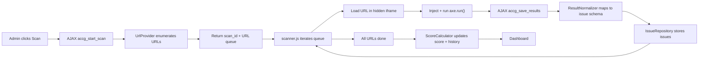

# Accessibility Guardian for WordPress

Automated **WCAG 2.2 Level AA** accessibility auditor that runs entirely inside the WordPress dashboard. It scans your posts, pages, custom post types, WooCommerce products and term archives with [axe-core](https://github.com/dequelabs/axe-core) and reports issues with severity ratings, WCAG references and remediation guidance — no external services, no Node.js, no headless browser.


---

## Why it's different

Most accessibility checkers either inject a front-end toolbar or require a server-side runtime (Node/Chromium) that typical WordPress hosts don't allow. Accessibility Guardian runs the real **axe-core** engine in the administrator's browser against a hidden, **same-origin iframe** of each page. That means it evaluates the *fully rendered* DOM — computed color contrast, ARIA, headings, landmarks, form labelling — while needing nothing more than standard WordPress hosting.

## Features

- **Scan modes** — single-page scan or full-site scan across posts, pages, public custom post types, WooCommerce products and term archives.
- **Real rendered-DOM analysis** — axe-core 4.10 plus supplemental custom checks:
  - generic link text ("click here", "read more", …)
  - placeholder used instead of a real label
  - links opening a new window without warning
  - linked PDF detection
- **Rich issue records** — every finding includes a rule id, WCAG reference, severity, category, HTML snippet, DOM path, a suggested fix and a documentation link.
- **Accessibility score (0–100)** with Excellent / Good / Needs Improvement / Poor bands.
- **Dashboard** — score circle, summary cards, issues by severity, WCAG category distribution, a progress-over-time trend and the most common problems.
- **Exports** — download any scan as CSV or JSON.
- **Privacy-friendly** — everything runs on your own site and browser; nothing is sent to third parties.

## How it works



## Requirements

| | |
| --- | --- |
| PHP | 8.0+ |
| WordPress | 6.4+ |

> The in-browser scanner needs pages to be embeddable in a same-origin iframe, so it will not work if the site sends `X-Frame-Options: DENY` (most sites don't).

## Installation

**From the packaged zip**

1. In wp-admin go to **Plugins → Add New → Upload Plugin**.
2. Upload `accessibility-guardian-1.1.0.zip` and click **Install Now**, then **Activate**.

**Manually**

1. Copy the `accessibility-guardian` folder into `wp-content/plugins/`.
2. Activate **Accessibility Guardian** from the Plugins screen.

The plugin ships with a fallback PSR-4 autoloader, so `composer install` is only needed for development.

## Usage

1. Open the **Accessibility Guardian** menu in the admin sidebar.
2. Go to **Run Scan** and start a single-page or full-site scan. Keep the tab open until it finishes.
3. Review results on the **Dashboard** and export them as CSV or JSON.
4. Configure which post types and term archives to include under **Settings**.

## Scoring

Starts at 100 and deducts per issue, then clamps to 0–100:

| Severity | Penalty |
| --- | --- |
| Critical | −10 |
| Major | −5 |
| Minor | −2 |
| Warning | −1 |

| Band | Score |
| --- | --- |
| Excellent | 95–100 |
| Good | 80–94 |
| Needs Improvement | 60–79 |
| Poor | < 60 |

## Project structure

```
accessibility-guardian/
├── accessibility-guardian.php   # Plugin bootstrap (header, constants, autoloader)
├── uninstall.php                # Drops tables + options on delete
├── src/
│   ├── Plugin.php               # Service container / hook wiring
│   ├── Activation/Installer.php # dbDelta schema
│   ├── Admin/                   # AdminMenu, AssetManager
│   ├── Scan/                    # UrlProvider, ScanController, ResultNormalizer, ScoreCalculator
│   ├── Rules/RuleCatalog.php    # axe rule → WCAG metadata mapping
│   ├── Storage/                 # ScanRepository, IssueRepository
│   └── Export/                  # CsvExporter, JsonExporter, ExportController
├── assets/
│   ├── js/axe.js                # Unminified axe-core 4.10.2 (MPL-2.0)
│   ├── js/axe.min.js            # Bundled axe-core 4.10.2 runtime
│   ├── js/scanner.js            # Hidden-iframe scan orchestrator
│   ├── js/custom-rules.js       # Supplemental checks
│   ├── js/dashboard.js          # Trend sparkline
│   └── css/admin.css
├── templates/                   # dashboard / scan / settings views
├── languages/                   # Translation template (.pot)
└── tests/phpunit/               # Unit tests
```

## Database tables

- `{prefix}accg_scans` — one row per scan (type, status, totals, score)
- `{prefix}accg_issues` — one row per detected issue
- `{prefix}accg_history` — score history for the trend chart

Settings are stored in the `accg_settings` option.

## Development

```bash
composer install
composer test          # PHPUnit
```

The PHPUnit suite (`tests/phpunit/`) covers the pure-logic classes (`ScoreCalculator`, `ResultNormalizer`, `UrlProvider`) using lightweight WordPress function stubs, so no WordPress install is required to run it.

## Roadmap

Planned for later phases: REST API, AI-assisted fixes, scheduled background scans, one-click automatic fixes, a front-end issue highlighter, HTML/PDF reports and page-builder-specific handling.

## License

[GPL-2.0-or-later](https://www.gnu.org/licenses/gpl-2.0.html). Bundles axe-core under the Mozilla Public License 2.0.
