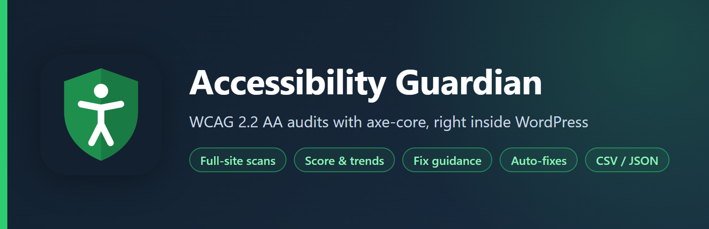
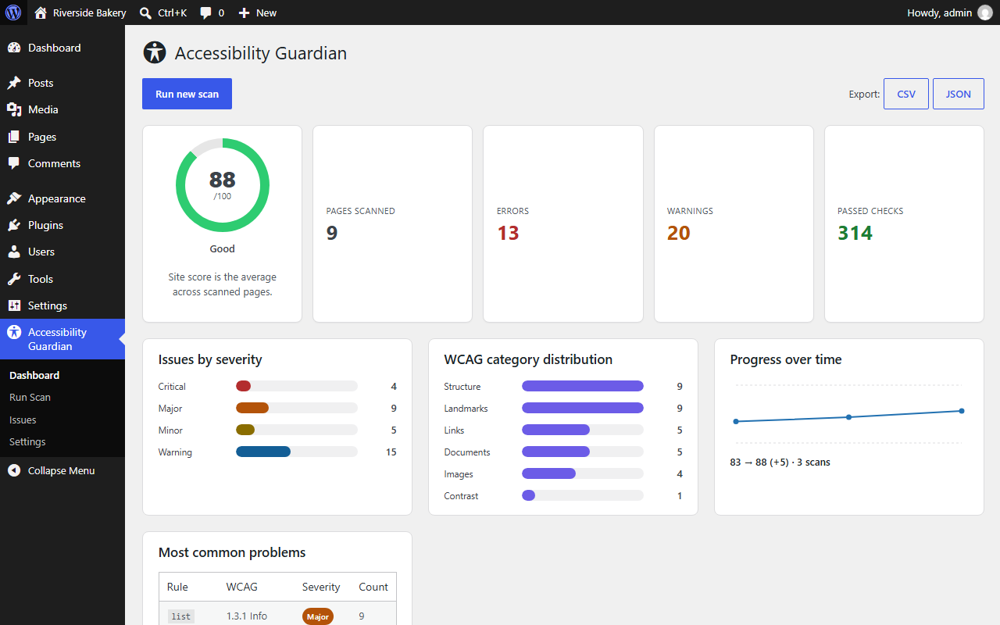
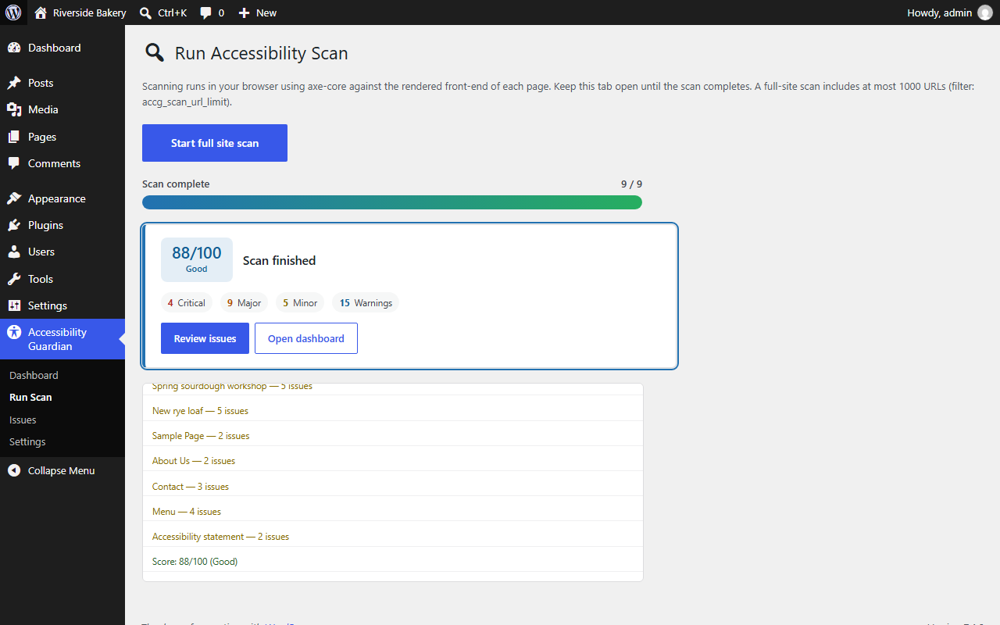
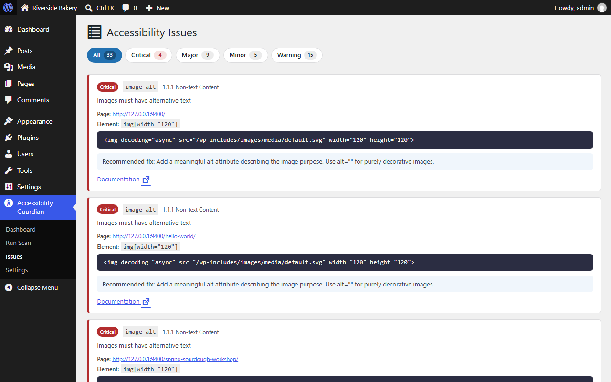
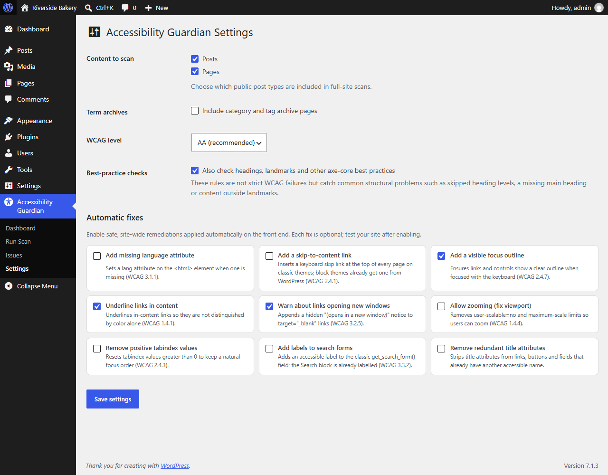
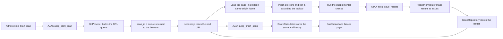

<p align="center">
  
</p>

# Accessibility Guardian for WordPress

[](https://github.com/esmobg/Accessibility-Guardian/actions/workflows/ci.yml)


Accessibility Guardian is a WordPress plugin that checks your site against **WCAG 2.2 Level A and AA** from the admin dashboard. It runs the [axe-core](https://github.com/dequelabs/axe-core) engine in the administrator's browser against the fully rendered front end of each page. You get a score, a prioritized list of issues with the exact element and a recommended fix, a progress chart, exports and optional one-click fixes.

There is no external service, no account and nothing to install on the server: no Node.js, no headless browser, no API key. If your site runs WordPress, it can be scanned.

> **Automated testing is not a compliance certificate.** Tools like this one find a large share of common problems quickly, but some WCAG requirements can only be checked by a person. Use the report to fix what is found, then test key pages with a keyboard and a screen reader.

---

## Contents

- [Screenshots](#screenshots)
- [Features](#features)
- [Requirements](#requirements)
- [Installation](#installation)
- [Usage](#usage)
- [Scoring](#scoring)
- [Automatic fixes](#automatic-fixes)
- [How it works](#how-it-works)
- [Architecture](#architecture)
- [Developer hooks](#developer-hooks)
- [Privacy](#privacy)
- [Limitations](#limitations)
- [FAQ](#faq)
- [Development](#development)
- [Releasing](#releasing)
- [Contributing](#contributing)
- [Changelog](#changelog)
- [License](#license)

## Screenshots

All screenshots are taken from a real WordPress 7.1 site (a demo bakery site with typical problems) by [`bin/screenshots/capture.js`](bin/screenshots/capture.js).

| Dashboard | Completed scan |
| --- | --- |
|  |  |
| **Issues** | **Settings** |
|  |  |

## Features

- **Full-site and single-page scans.** Posts, pages, public custom post types (including WooCommerce products) and optional category and tag archives. A **Scan accessibility** link in the toolbar starts a single-page scan of whatever published page you are viewing.
- **Analysis of the real, rendered page** with axe-core 4.10.2, so computed colours, ARIA states, generated content and theme markup are all taken into account.
- **WCAG 2.0, 2.1 and 2.2** at Level A or AA (your choice).
- **Best-practice checks** (on by default) for headings, landmarks and structure, reported as warnings.
- **Supplemental checks** that axe-core does not cover:
  - generic link text such as "click here", "read more" or "more"
  - form fields that rely on a placeholder instead of a label
  - links that open a new window or tab without saying so
  - linked PDF documents that need a manual accessibility check
- **Actionable issue records:** severity, WCAG success criterion, category, page URL, CSS path to the element, its HTML, a recommended fix and a documentation link.
- **Accessibility score** (0–100) per scan with Excellent / Good / Needs Improvement / Poor bands.
- **Dashboard:** score, pages scanned, errors, warnings and passed checks, issues by severity, WCAG category distribution, a progress-over-time chart, the most common problems and recent scans.
- **Issues page** with severity tabs and pagination.
- **Optional automatic fixes** applied on the front end through WordPress hooks (see [Automatic fixes](#automatic-fixes)).
- **CSV and JSON export** of any scan.
- **Multisite:** per-site or network activation, automatic setup for new sites, clean-up when a site is deleted.
- **Translation-ready** (`accessibility-guardian` text domain).
- **Accessible itself:** the plugin's admin screens pass axe-core WCAG 2.2 AA and best-practice checks.

## Requirements

| | |
| --- | --- |
| WordPress | 6.4 or later (tested up to 7.1; also checked against 7.2-alpha) |
| PHP | 8.0 or later (tested on 8.0, 8.3, 8.4 and 8.5) |
| Browser | Any current Chrome, Edge, Firefox or Safari for the admin who runs scans |
| Framing | Your pages must be allowed in a same-origin frame (see below) |

The scanner loads each page in a hidden frame on your own domain. That works unless your site sends `X-Frame-Options: DENY` or `Content-Security-Policy: frame-ancestors 'none'`. `X-Frame-Options: SAMEORIGIN` and `frame-ancestors 'self'` are fine. Pages that cannot be framed are reported as "could not be scanned" and the rest of the scan continues.

## Installation

**From WordPress.org** (once the listing is live)

1. Go to **Plugins > Add New Plugin** and search for "Accessibility Guardian".
2. Click **Install Now**, then **Activate**.

**From a release zip**

1. Download `accessibility-guardian-<version>.zip` from the [latest GitHub release](https://github.com/esmobg/Accessibility-Guardian/releases/latest).
2. Go to **Plugins > Add New Plugin > Upload Plugin**, choose the zip and click **Install Now**, then **Activate**.

> Do not use GitHub's green **Code > Download ZIP** button for installation. That archive is the development repository: it unpacks to a folder called `Accessibility-Guardian-main` and includes tests and tooling. Use the release zip instead.

**From git** (for development)

```bash
cd wp-content/plugins
git clone https://github.com/esmobg/Accessibility-Guardian.git accessibility-guardian
```

The plugin includes its own autoloader, so `composer install` is only needed to run the tests.

## Usage

1. Open **Accessibility Guardian > Run Scan** and click **Start full site scan**. The progress bar and log show each page as it is checked. Keep the tab open until the scan finishes, or click **Cancel** to stop after the current page (a cancelled scan keeps its partial results but does not replace your latest complete report).
2. To check one page, open it on the front end while logged in and click **Scan accessibility** in the toolbar. You can also go to `wp-admin/admin.php?page=accessibility-guardian-scan&post_id=123`.
3. Review the findings under **Issues**. Use the severity tabs to focus on Critical and Major problems first. Each card shows the page, the element, its HTML and a recommended fix.
4. Check the **Dashboard** for the score, the breakdown by severity and WCAG category, the progress chart and the most common problems.
5. Export any scan with the **CSV** or **JSON** buttons on the dashboard.
6. Under **Settings**, choose the post types to scan, whether to include term archives, the WCAG level (A or AA), whether to run best-practice checks, and which automatic fixes to enable.

## Scoring

Every scanned page starts at 100 and loses points for each issue, with a minimum of 0:

| Severity | Penalty | Typical examples |
| --- | --- | --- |
| Critical | −10 | missing image alt text, unlabeled buttons, missing document language |
| Major | −5 | low contrast, missing form labels, broken list structure |
| Minor | −2 | generic link text, placeholder-only fields |
| Warning | −1 | items that need manual review, best-practice findings, new-window links, PDFs |

The **site score** is the average of the per-page scores, so one bad page does not hide an otherwise good site and pages without issues count as 100.

| Band | Score |
| --- | --- |
| Excellent | 95–100 |
| Good | 80–94 |
| Needs Improvement | 60–79 |
| Poor | below 60 |

On the dashboard, **Errors** are Critical + Major issues and **Warnings** are Minor + Warning issues.

## Automatic fixes

All fixes are off by default. They use WordPress hooks and small front-end assets; your theme files are never edited. Enable one at a time and check your site.

| Fix | What it does | WCAG | Notes |
| --- | --- | --- | --- |
| Add missing language attribute | Sets `lang` on `<html>` when the theme leaves it out | 3.1.1 | Uses the site language |
| Add a skip-to-content link | Adds a keyboard skip link at the top of every page | 2.4.1 | Classic themes only; block themes already get one from WordPress. Target filterable with `accg_skip_link_target` |
| Add a visible focus outline | Shows a clear outline on focused links and controls | 2.4.7 | Uses `:focus-visible`, so mouse clicks are unaffected |
| Underline links in content | Underlines links inside post content | 1.4.1 | Buttons and navigation menus are left alone |
| Warn about links opening new windows | Adds a hidden "(opens in a new window)" to `target="_blank"` links | 3.2.5 | Also adds `rel="noopener"` |
| Allow zooming | Removes `user-scalable=no` and `maximum-scale` limits | 1.4.4 | |
| Remove positive tabindex values | Resets `tabindex` greater than 0 to 0 | 2.4.3 | |
| Add labels to search forms | Adds `aria-label` to the classic `get_search_form()` field | 3.3.2 | The Search block is already labelled |
| Remove redundant title attributes | Removes `title` from links, buttons and fields that already have another accessible name | — | A field labelled only by `title` keeps it |

Fixes that change elements are re-applied to content added after the page loads, for example by the Interactivity API router or "load more" buttons.

## How it works


```mermaid
flowchart LR
  admin[Admin clicks Start scan] --> start["AJAX accg_start_scan"]
  start --> urls[UrlProvider builds the URL queue]
  urls --> queue[scan_id + queue returned to the browser]
  queue --> loop[scanner.js takes the next URL]
  loop --> iframe[Load the page in a hidden same-origin frame]
  iframe --> run["Inject axe-core and run it, excluding the toolbar"]
  run --> custom[Run the supplemental checks]
  custom --> save["AJAX accg_save_results"]
  save --> norm[ResultNormalizer maps results to issues]
  norm --> store[IssueRepository stores the issues]
  store --> loop
  loop --> done["AJAX accg_finish_scan"]
  done --> score[ScoreCalculator stores the score and history]
  score --> dash[Dashboard and Issues pages]
```

1. **Start.** `accg_start_scan` builds the queue of URLs (home page, published content in ID order, optional term archives, capped at 1,000) and creates a scan record.
2. **Scan.** For each URL, `assets/js/scanner.js` loads the page in a sandboxed, same-origin frame, injects the bundled axe-core and runs it with the configured WCAG tags. `assets/js/custom-rules.js` adds the supplemental checks. The WordPress toolbar is excluded.
3. **Save.** The results are sent to `accg_save_results`, normalized into issue rows (severity, WCAG reference, category, fix, documentation link) and stored.
4. **Finish.** `accg_finish_scan` calculates the per-page and site score, stores the totals and adds a point to the history, or marks the scan as cancelled.

All AJAX requests require the `accg_scan` nonce and the capability returned by `accg_required_capability` (default `manage_options`).

## Architecture

```text
accessibility-guardian/
├── accessibility-guardian.php     Plugin header, constants, autoloader, hooks
├── uninstall.php                  Removes tables and options (every site on multisite)
├── readme.txt                     WordPress.org readme
├── src/
│   ├── Plugin.php                 Service container, hook wiring, capability helper
│   ├── Activation/Installer.php   Tables (dbDelta), default settings, multisite setup
│   ├── Admin/AdminMenu.php        Menu pages, settings form, toolbar scan link
│   ├── Admin/AssetManager.php     Admin scripts and styles, scanner configuration
│   ├── Scan/UrlProvider.php       Builds the URL queue
│   ├── Scan/ScanController.php    AJAX endpoints: start, save, finish
│   ├── Scan/ResultNormalizer.php  axe results → issue rows
│   ├── Scan/ScoreCalculator.php   Page and site scores, bands
│   ├── Rules/RuleCatalog.php      Rule → WCAG reference, category, severity, fix
│   ├── Storage/ScanRepository.php, IssueRepository.php
│   ├── Export/                    CSV and JSON exporters, download endpoint
│   └── Fixes/AutoFixer.php        Optional front-end fixes
├── assets/
│   ├── js/axe.min.js, axe.js      axe-core 4.10.2 (MPL-2.0), minified and source
│   ├── js/scanner.js              Scan orchestrator (runs in wp-admin)
│   ├── js/custom-rules.js         Supplemental checks
│   ├── js/dashboard.js            Progress chart
│   ├── js/frontend-fixes.js       DOM-based automatic fixes
│   └── css/admin.css, frontend-fixes.css
├── templates/                     Dashboard, Run Scan, Issues and Settings views
└── languages/                     accessibility-guardian.pot
```

Repository-only folders (not in the release zip): `tests/` (PHPUnit), `bin/` (build and screenshot tools), `docs/` (QA notes and the WordPress.org submission guide), `wp-org-assets/` (WordPress.org icons, banners, screenshots and Live Preview blueprint) and `.github/` (CI and releases).

### Stored data

| Name | Type | Contents |
| --- | --- | --- |
| `{prefix}accg_scans` | table | One row per scan: type, status (`running`, `complete`, `cancelled`, `failed`), URL counts, score, totals |
| `{prefix}accg_issues` | table | One row per finding |
| `{prefix}accg_history` | table | Score history for the progress chart (complete scans only) |
| `accg_settings` | option | Post types, term archives, WCAG level, best-practice checks, enabled fixes |
| `accg_db_version` | option | Installed schema version |

### Endpoints

| Endpoint | Purpose |
| --- | --- |
| `wp_ajax_accg_start_scan` | Build the URL queue and create a scan |
| `wp_ajax_accg_save_results` | Store the results for one URL |
| `wp_ajax_accg_finish_scan` | Calculate the score and close the scan (`cancelled=1` for a cancelled scan) |
| `admin_post_accg_export` | Download a scan as CSV or JSON (nonce `accg_export`) |

## Developer hooks

### Filters

| Filter | Default | Description |
| --- | --- | --- |
| `accg_scan_url_limit` | `1000` | Maximum number of URLs in a full-site scan (clamped to 1–10,000) |
| `accg_scan_urls` | built queue | The full-site URL queue before it is capped. Each entry is `[ 'url' => string, 'post_id' => int, 'label' => string ]`. Second argument: the limit |
| `accg_axe_options` | `[ 'runOnly' => [ 'type' => 'tag', 'values' => [...] ] ]` | Options passed to `axe.run()` for every page |
| `accg_required_capability` | `manage_options` | Capability needed to view reports, run scans, export and change settings |
| `accg_skip_link_target` | `#content` | `href` of the skip link added by the skip-link fix |

### Actions

| Action | Arguments | Description |
| --- | --- | --- |
| `accg_scan_completed` | `int $scan_id`, `array $totals` (`score`, `errors`, `warnings`, `passes`) | Fires after a scan finishes and its score is stored (not for cancelled scans) |

### Examples

```php
// Also scan a landing page that is not a post, and drop a private section.
add_filter( 'accg_scan_urls', function ( array $urls ) {
	$urls[] = array( 'url' => home_url( '/campaign/' ), 'post_id' => 0, 'label' => 'Campaign landing page' );

	return array_values( array_filter( $urls, fn ( $entry ) => ! str_contains( $entry['url'], '/members/' ) ) );
} );

// Ignore a third-party widget and turn off one rule.
add_filter( 'accg_axe_options', function ( array $options ) {
	$options['rules'] = array( 'region' => array( 'enabled' => false ) );

	return $options;
} );

// Let editors run scans and see reports.
add_filter( 'accg_required_capability', fn () => 'edit_others_posts' );

// Notify the team when a scan finishes with a low score.
add_action( 'accg_scan_completed', function ( int $scan_id, array $totals ) {
	if ( $totals['score'] < 80 ) {
		wp_mail( get_option( 'admin_email' ), 'Accessibility score dropped', sprintf( 'Scan #%d scored %d/100.', $scan_id, $totals['score'] ) );
	}
}, 10, 2 );
```

## Privacy

- Scans run on your own site and in your own browser. Page content and results are never sent to the plugin author or any third party.
- Results are stored in your WordPress database and deleted when the plugin is deleted.
- Documentation links point to dequeuniversity.com and w3.org and are only opened when clicked.
- Pages are scanned as the logged-in administrator, so analytics on the site may record those page views.

## Limitations

- Scans run in the browser one page at a time; the admin tab must stay open. Each page has a 30-second timeout.
- Pages are checked at a desktop width (1280 px), so issues that only appear on small screens may be missed.
- Content behind interactions (menus that open on click, modal dialogs, tabs) is checked in its initial state only.
- Very strict `script-src` Content Security Policies can prevent axe-core from loading in the scan frame.
- Automated checks cannot judge things like the quality of alternative text, reading order or captions. Plan a manual review too.

## FAQ

**Does this make my site compliant with the ADA, the EAA, EN 301 549 or Section 508?**
No tool can do that on its own. It finds many common failures quickly; a manual review is still needed.

**Why is a page "could not be scanned"?**
Usually because it cannot be framed (`X-Frame-Options: DENY`, `frame-ancestors 'none'`), it took longer than 30 seconds to load, or a strict Content Security Policy blocked axe-core.

**Will the toolbar or the plugin's own markup show up in the results?**
No. The WordPress toolbar is excluded from every check.

**Does it slow down my site for visitors?**
No. Nothing is loaded on the front end unless you enable an automatic fix. Enabled fixes add one small stylesheet and, for some fixes, one small deferred script (a few KB each).

**Does it work with page builders and block themes?**
Yes. It checks the final rendered HTML, whatever produced it. The automatic fixes are aware of block themes.

## Development

```bash
composer install       # PHPUnit 9.6 (PHP 8.0) or 10.5 (PHP 8.1+)
composer test          # run the unit tests
composer lint          # php -l on every PHP file
```

The PHPUnit suite in `tests/phpunit/` covers the pure-logic classes (`ScoreCalculator`, `ResultNormalizer`, `RuleCatalog`, `UrlProvider`, `CsvExporter`) with lightweight WordPress function stubs, so no WordPress install is needed.

### Running WordPress locally with Playground

[WordPress Playground](https://wordpress.github.io/wordpress-playground/) runs WordPress in Node.js with no database or web server to set up.

```bash
python bin/build-zip.py --dir .build
npx @wp-playground/cli@latest server --port=9400 --login \
  --mount-dir .build/accessibility-guardian /wordpress/wp-content/plugins/accessibility-guardian \
  --mount-dir bin/screenshots /wordpress/accg-tools \
  --blueprint=bin/screenshots/blueprint.json
```

Open http://127.0.0.1:9400. The blueprint activates the plugin and creates a small demo site with typical accessibility problems. Change `preferredVersions` in the blueprint to test other WordPress and PHP versions (for example `"wp": "6.4", "php": "8.0"`).

### Plugin Check

Before every release, run [Plugin Check](https://wordpress.org/plugins/plugin-check/) on the built plugin (all categories, errors and warnings). CI does this automatically on every push. Locally, install the Plugin Check plugin in Playground and use **Tools > Plugin Check**, or run:

```bash
wp plugin check accessibility-guardian
```

### Regenerating screenshots and WordPress.org assets

```bash
npm install --no-save playwright && npx playwright install chromium
# with the Playground server from above running:
node bin/screenshots/capture.js http://127.0.0.1:9400 wp-org-assets
node bin/screenshots/render-brand.js     # icon-128/256 and banner-772/1544 from icon.svg and brand.html
```

### Translations

Regenerate the template after changing strings:

```bash
wp i18n make-pot . languages/accessibility-guardian.pot --exclude=tests,bin,docs,dist,.build,vendor,node_modules
```

## Releasing

1. Update the version in `accessibility-guardian.php` (header and `ACCG_VERSION`), `Stable tag` in `readme.txt`, the changelog in `readme.txt` and [`CHANGELOG.md`](CHANGELOG.md).
2. Build the zip: `python bin/build-zip.py`. It reads the version from the plugin header, refuses to build if `Stable tag` does not match, excludes everything listed in [`.distignore`](.distignore) and always uses `accessibility-guardian/` as the root folder.
3. Push a tag such as `v1.2.0`. The [release workflow](.github/workflows/release.yml) builds the same zip and attaches it to a GitHub release.
4. Publish to WordPress.org with SVN as described in [`docs/qa/wordpress-org-submit.md`](docs/qa/wordpress-org-submit.md).

## Contributing

Issues and pull requests are welcome. Please:

- follow the [WordPress Coding Standards](https://developer.wordpress.org/coding-standards/wordpress-coding-standards/) (tabs, `array()`, Yoda conditions);
- prefix everything global with `accg_` / `ACCG_` / `AccessibilityGuardian\`;
- sanitize input, escape output and check nonces and capabilities on every request;
- add or update tests for logic changes and make sure CI passes.

To report a security problem, please do not open a public issue; report it privately through the repository's **Security** tab instead.

## Changelog

See [`CHANGELOG.md`](CHANGELOG.md).

## License

Accessibility Guardian is licensed under the [GPL-2.0-or-later](LICENSE.txt).

It bundles [axe-core](https://github.com/dequelabs/axe-core) 4.10.2 by Deque Systems, licensed under the [Mozilla Public License 2.0](https://www.mozilla.org/MPL/2.0/), which is GPL-compatible. The unminified source is included as `assets/js/axe.js`.
